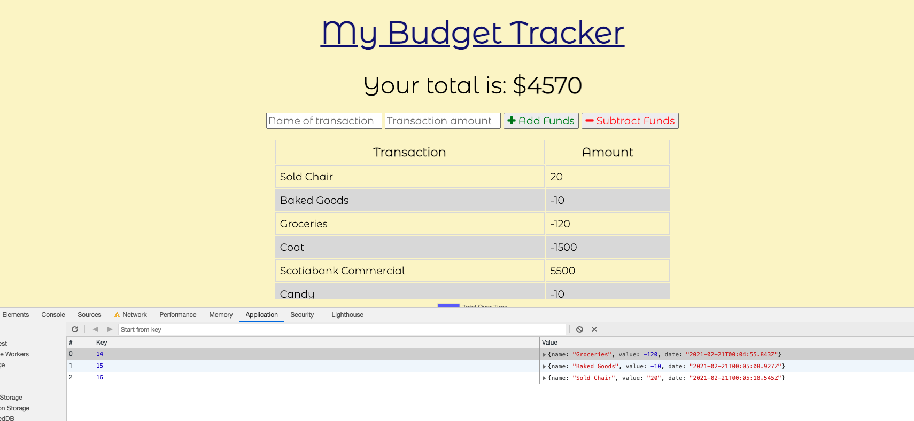

# MT-Budget_Tracker

## Description 

You earn money, you spend money, you respect money. You're diligent about keeping track of your expenses, no matter where you are. That's why we give you our simple Budget Tracker. But sometimes you are sitting on the subway or in an elevator shaft and your Tracker can't reach the network to make sure everything is saved on the Tracker's server. Don't worry! 
**Burn some incense, you won't be insenced. Your good cents sense will be sent when the network is sensed!**

## TABLE OF CONTENTS

1. [Installation](#Installation)
2. [Usage](#Usage)
3. [Contributing](#Contributing)
4. [Tests](#Tests)
5. [Questions/Contact](#Questions/Contact)
6. [License](#License)

## Installation

Simply navigate to .

## Usage

When you navigate to the site, you'll see a field that shows how much money you have **deposited** to your tracker. If the number is negative, you best get some dough! (None of my business.)

Right below that, you'll see a few fields where you can enter the name of a transaction and the amount. Click "Add Funds" or "Subtract Funds" appropriately. The newest transaction will appear at the top of a table, and below all that, there is a handy-dandy chart so you can see the ups and downs of your cash flow. 

Now, for some behind-the-scenes magic. If you are recording your spending while disconnected from the network, your transactions will be saved in what we in the computing world call "on your device". OK, we actually called it "IndexedDB", which is a form of local storage for data. Below you will see a few transactions that were added while we disconnected the Tracker from the internet.

It was a chocolate croissant and an apricot loaf from a bakery. Delicious. I know you were wondering. 

This final image shows some more behind-the-scenes magic. You can see on the left the transactions are there, but on the right is a representation of the place where your transactions are being stored so that when you access Budget Tracker the next time, they'll all be there. Looking on the right, you'll see the last three items in the list are the last three transactions I added.

And I'll be using the apricot loaf to make French Toast while listening to Broadway musicals. 

## Contributing

If you would like to contribute to this project, please contact me with the information below. You are incouraged to follow the [Contributor Covenant](https://www.contributor-covenant.org/). 

## Tests

There are no included tests for this project. Testing during development simply involved a lot of connecting and disconnecting the server so that the functionality good be monitored. 

## Questions/Contact

GitHub Profile: [https://github.com/Torontow](https://github.com/Torontow)
Email: [mtorontow0@gmail.com](mailto:mtorontow0@gmail.com)

## License

This project is covered under MIT license.

[Top](#MT-Budget_Tracker)
